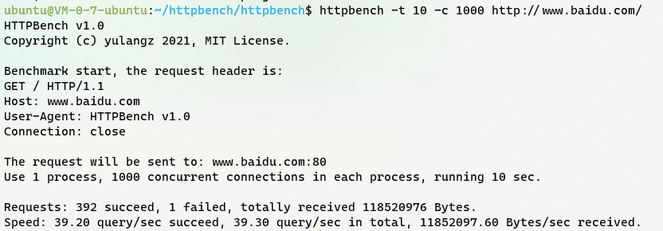

# httpbench
## Introduction
httpbench is a simple http benchmark app base on linux epoll.
Its performance is slightly higher than that of webbench.

## Install
```shell
git clone https://github.com/yulangz/httpbench.git
make
make install
```

## Usage
```shell
httpbench [option]... URL
  -t|--time <sec>          Run benchmark for <sec> seconds. Default 30.
  -p|--process <n>         Run benchmark with n process. Default 1.  -c|--concurrency <n>     Run <n> concurrent connection in each process. Default 1.
  -r|--reload              Send reload request -- Pragma:no-cache and Cache-Control:no-cache.
  -P|--proxy <server:port>    Use proxy server for request.
  --http10                 Use HTTP/1.0 protocol.
  --http11                 Use HTTP/1.1 protocol. Default ust HTTP/1.1 .
  --http20                 Use HTTP/2.0 protocol.
  --get                    Use GET request method. By default, the method is GET.
  --head                   Use HEAD request method.
  --options                Use OPTIONS request method.
  --trace                  Use TRACE request method.
  -?|-h|--help             Print this message.
  -V|--version             Print program version.
```



## Contributing
Welcome any pull requests.
